# Fiid Match & Win Memory Game

## Code Institute MS2 Project in Interactive Frontend Development 
The brief was to develop an interactive front-end site which responds to the users' actions, allowing them to actively engage with data, alter the way the site displays the information to achieve their preferred goals. This website is created for educational purposes.

[View website in GitHub Pages.](https://natashaclerkin.github.io/fiid-memory-game-MS2/) 

## [Fiid Match & Win Memory Game](https://natashaclerkin.github.io/fiid-memory-game-MS2/) 

Irish plant-based food B2C company, Fiid, are looking to further brand awareness and increase customer acquisition. They would like to drive sales by creating a timed memory game for users to win discount code for their next online purchase. The user has to match two of each product type before the time runs out. If they are successful, they are able to subscribe to earn a discount code which will be valid for their next purchase. Users have the ability to share the game with their followers on social media. The target audience are health-conscious individuals, particularly the millennial bracket who like games and discounts. 

The primary goal of the main Fiid website is to inform and direct users to place an order. I wanted to create an experience that integrates with their main website. This would include instructions on how the game works, how to obtain the discount code through a short signup form and how they can spread the word through social media. There would also be links to the company's social media channels and most importantly the main online store. This would allow users to learn more about the products, place an order or share the game with their followers on their own channels.

The opportunity to win a discount code incentivizes participation aswell as increasing brand recognition and follower engagement. In order to obtain the discount code, the user has to register through an entry form for lead generation and simultaneously allows the user to sign up to the newsletter. The concept is to offer a discount to all registered users in order to convert them into paying customers.

**The business goals of this website are:**

- To market the current offering of Fiid products.
- Increase customer acquisition.
- To increase brand recognition and follower engagement. 
- Make the brand stand out from the swarm of plant-based companies during Veganuary 
- Target a younger audience who have more disposible income such as millennials.

**The customer goals of this website are:**

- Learn about the product offering
- Obtain a discount towards future orders
- Have a good experience while on the site

# UX

### Strategy
It's vital as a B2C company to stand out amongst the competition because the B2C space is crowded with competitors. Most users will make their purchase on one of their first few visits so it is so important to grab the user and keep them on the site long enough to place the order. Compelling but minimal text accompanied by lots of imagery is required to keep the user engaged. 
As the memory game is a huge part of the customer acquisition process, it has to be developed to a high standard and respond correctly to the user's interactions. The overall game will be simple enough for the user to complete in order to reward them for their time and encourage them to place an order.  

#### Ideal users of this website:
- Vegan/health-conscious individuals
- Working adults who are looking for convenient meal products for themselves or their families 
- Millennials

#### These users are looking for:
- Discounts
- Quality, healthy and convenient products
- Hassle-free ordering

#### This project is the best way to achieve their goals because:
The market is saturated with plant-based products and the user wants a quality product at a discounted price. The short game makes the company stand out from the crowd and rewards the user if they can remember the brand's offering.

#### User Stories
 
1. **_As a new visitor to the website,_** I want to find out about the products on offer and why I should purchase from the company as opposed to similar brands so that I can potentially become a customer. 

2. **_As a regular customer of the brand,_** I want to be rewarded for my loyalty so that I can receive discounts/offers on future orders and remain a loyal customer.  

3. **_As a user on the site,_** I want to have an enjoyable and hassle-free experience so that I can potentially place an order.

### Scope
To achieve the strategic goals, I wanted to include the following features in this production release:

- Simple and short signup form
- Nav bar with minimal content - i.e. just social media links and link to main site
- Simplistic timed memory game using JavaScript - including countdown and flip counter

### Structure 
The user will be presented with a short, simple user-friendly game leaving them with an enjoyable experience, a lasting memory of the 4 products and hopefully a discount to use at the checkout.
 
### Skeleton
- [Wireframes](assets/wireframes/wireframes.pdf "Fiid Wireframes"): The project contains the instructions screen, the game screen, gameover screen and win screen.
**Please note the finalised project contains slight variations to the original wireframe**

### Surface 
As a B2C company, sales are emotionally driven and often as an impulse buy. Branding is a huge factor and emotional triggers lead a customer to purchase a product. It was important to build the memory game on a page that reflected the brand and their product offering. The monochrome colour scheme was implemented along with pops of green to reflect the healthy and fresh products.
The banner assets of fresh produce and company typography was also implemented to integrate the game page as part of the brand and propel the user towards the shop after completion.

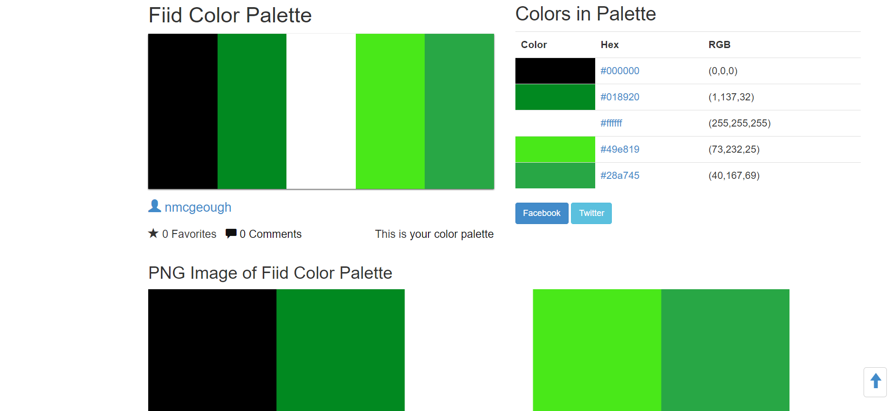

# Features

The fully responsive website consists of 

### Features Left to Implement
Due to time restraints, I was unable to include the following features but hope to implement them in a future release:

# Technologies Used

In the construction of this project I have utilised the following languages, frameworks, libraries and tools:
- **HTML5,** **CSS3** and **JavaScript** programming languages
- [Bootstrap v4.5.3](https://getbootstrap.com)
    - The project used **Bootstrap** to simplify the website layout by integrating the Congrats Modal and Navbar. Also to provide overall responsive behaviour on all devices.
- [GitPod](https://www.gitpod.io/)
    - I used **GitPod** as the development environment for my website. I also used Git for Version Control in the project.
- [GitHub](https://www.github.com/)
    - The project used **GitHub** to host my code that was created and pushed from GitPod.
- [Balsamiq](https://balsamiq.com/)
    - I used **Balsamiq**, the rapid low-fidelity UI wireframing tool during the prototyping phase to structure the website and its content following best UX practices.
- [Color Hex](https://www.color-hex.com/)
    - I created the color palette for my project using the theme colours of the main Fiid website and **Color Hex** to help structure the UI for the game. 
- [Photoshop](https://www.photoshop.com)
    - I created the background image using the image graphics editor **Photoshop** so each Fiid product is visually on screen for the duration of the game to further brand/product awareness.
- [Chrome Dev Tools](https://developers.google.com/web/tools/chrome-devtools)
    - **Chrome Dev Tools** was used to consistently test the site and run reports from Lighthouse.
- [Google Fonts](https://getbootstrap.com)
    - **Google Fonts** was used to style the website fonts.
- [Favicon.io](https://favicon.io/)
    - **Favicon.io** was used to generate the favicons for the site.    
- [Freeformatter CSS Beautify](https://www.freeformatter.com/css-beautifier.html)
    - I used **CSS Beautify** to format and automatically indent my CSS file.
- [Freeformatter HTML Formatter](https://www.freeformatter.com/html-formatter.html)
    - The **HTML Formatter** was used to format the HTML document.  
- [Freeformatter JS Formatter](https://www.freeformatter.com/javascript-beautifier.html)
    - The **JavaScript Formatter** was used to format the JS file.      
- [Unicorn Revealer](https://chrome.google.com/webstore/detail/unicorn-revealer/lmlkphhdlngaicolpmaakfmhplagoaln)
    - I regularly used the **Unicorn Revealer** Chrome extension to inspect and locate where overflow was located making the debugging process a lot easier. 
- [Autoprefixer](https://autoprefixer.github.io)
    - The project used PostCSS plugin **Autoprefixer** which parsed my CSS and added vendor prefixes to allow cross-browser compatibility and support.
- [Color Contrast Accessibility Validator](https://color.a11y.com/)
    - The **Color Contrast Accessibility Validator** was used to test for colour contrast on the project.
- [W3C Markup Validation Service](https://validator.w3.org/)
    - The **W3C Markup Validation Service** checked the markup validity of Web documents in HTML.
- [W3C CSS Validation Service](https://jigsaw.w3.org/css-validator/)
    - **W3C CSS Validation Service** was used to check the validity of my CSS in the project.
- [JS Hint Validator](https://jshint.com/)
    - **JS Hint** was used to analyze and ensure the source code complies with coding rules. 
- [WAVE Web Accessibility Evaluation Tool](https://wave.webaim.org/)
    - I used **WAVE** to make my site more accessible to individuals with disabilities by detecting any potential issues.

# Testing

## UX stories testing

## Validation
I used the [W3C Markup Validation Service](https://validator.w3.org/) to check the Markup and [W3C CSS Validation Service](https://jigsaw.w3.org/css-validator/) to check the CSS validity and [JS Hint Validator](https://jshint.com/) to check the JS rules of the project. After fixing the errors on all testing sites, the sites eventually passed validation.

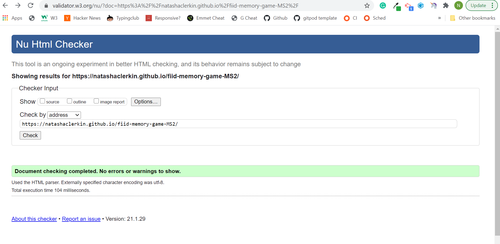

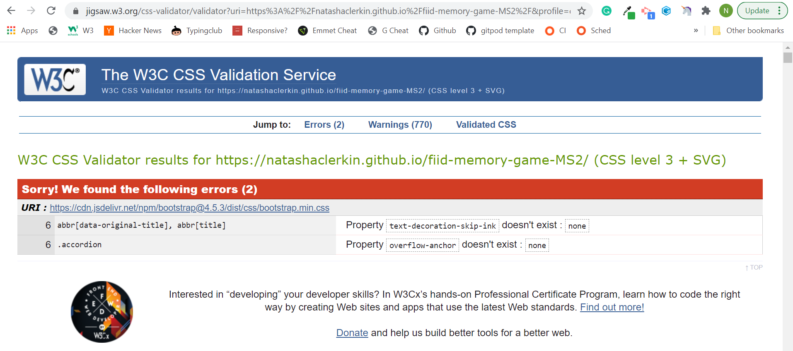

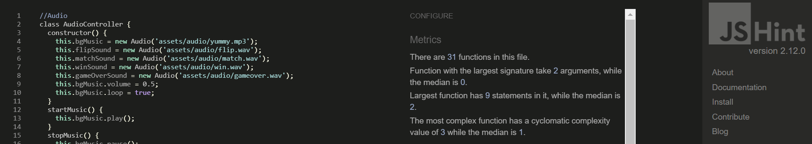

The [Color Contrast Accessibility Validator](https://color.a11y.com/) was used to test for colour contrast on the project.

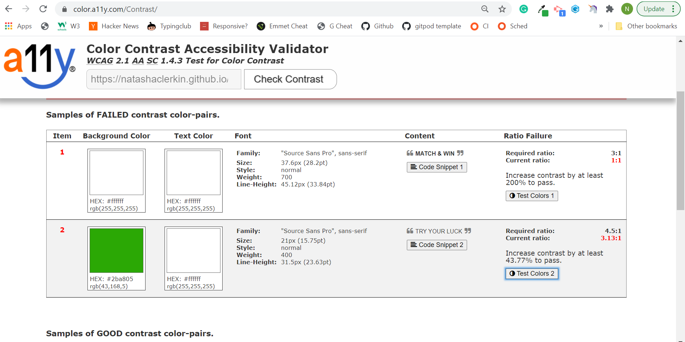

I found one of the original green shades used for the buttons wasn't working from an accessibility standpoint. I used the contrast testing feature to choose a hex color that would pass the validation tests.

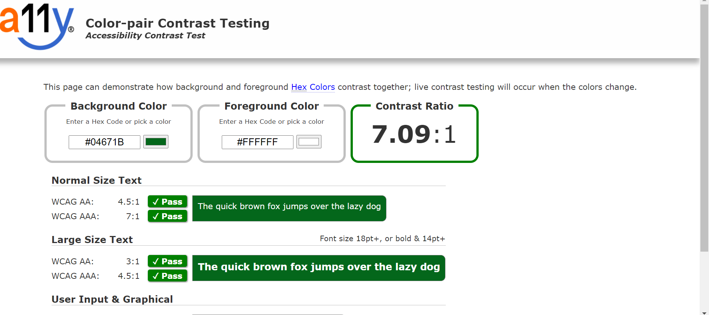

When I decided on the final shade, I re-ran the tests confirming no further colour contasting issues to be found and the overall site complies with accessibility standards.

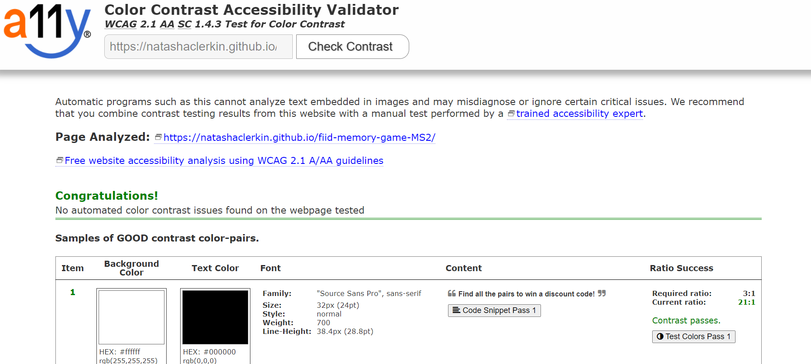

In order to have optimal user experience, the site needs to be accessible. I would continually run the URL through **WAVE Web Accessibility Evaluation Tool** to highlight potential issues. I continued until no further errors or alerts were given.

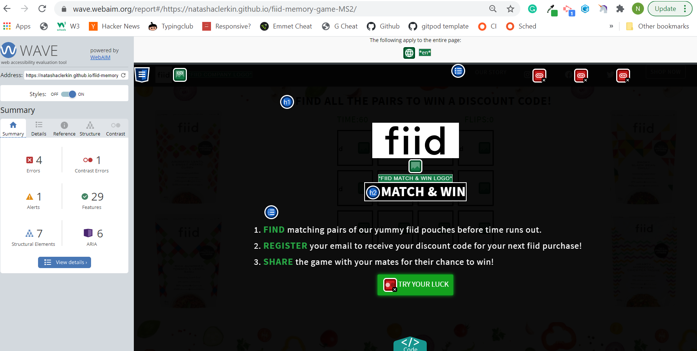

I constantly tested the code in [Chrome Dev Tools](https://developers.google.com/web/tools/chrome-devtools) and often ran Lighthouse audits to identify and fix issues that affected the site's performance, accessibility and user experience. 

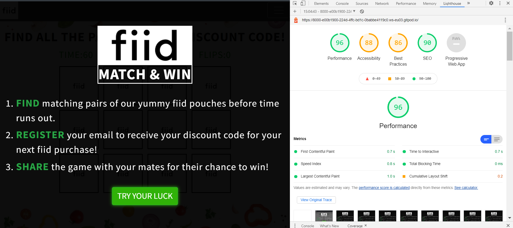

This highlighted areas that require improvement for validation. For example, Accessibility issues pointed to areas such as inadequate color contrast ratio which I tested and fixed in **Color Contrast Accessibility Validator**.
Also, a Cross-Origin security issue pertaining to Best Practices was simply resolved via adding `rel= noreferrer` to external links. I also ensured all the necessary aria labels, alt tags etc were present to conform to best practices. 
Through constant testing, I was able to achieve almost 100% on all metrics for optimum Performance, Accessibility, SEO and Best Practices.  

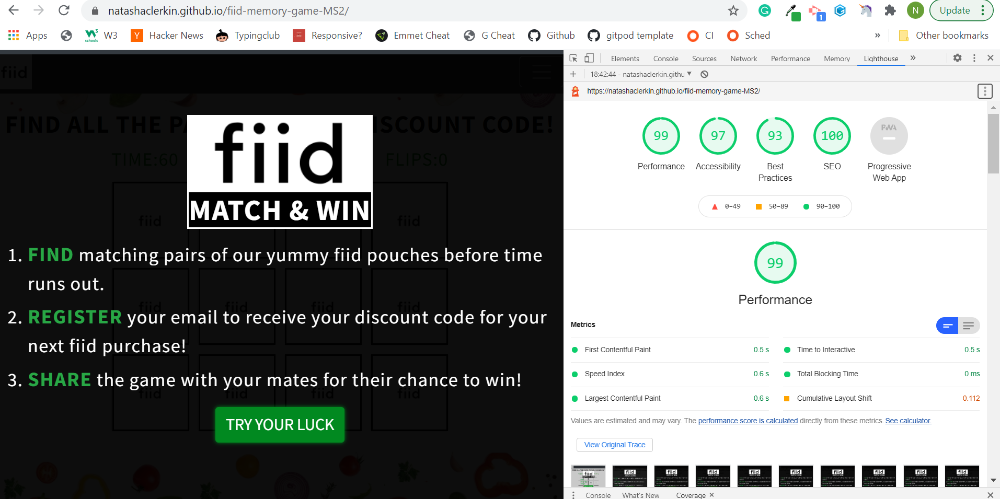

I asked my family, friends and fellow students to test their site on different devices to locate potential bugs. The website was tested over multiple devices (iPhone 5, 6, 11: Safari and Chrome, iPad, Samsung Galaxy) and many browsers (Chrome, Firefox, Safari and Edge) to guarantee responsive behaviour and compatibility.  

# Deployment
This site is hosted using GitHub pages, deployed directly from the master branch. The deployed site will update automatically upon new commits to the master branch. For the site to deploy correctly on GitHub pages, the landing page must be named index.html.

To run locally, you can clone this repository directly into the editor of your choice by pasting git clone https://natashaclerkin.github.io/fiid-memory-game-MS2 into your terminal. To cut ties with this GitHub repository, type git remote rm origin into the terminal.

My project was developed using the IDE, Gitpod. I deployed my website from the GitHub repository to GitHub Pages using the following steps:

1. I selected the Settings tab in my GitHub repository.
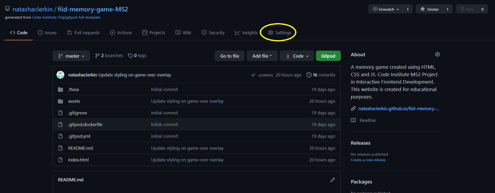

2. I located the GitHub Pages section and chose the Master branch as the source to enable GitHub Pages.
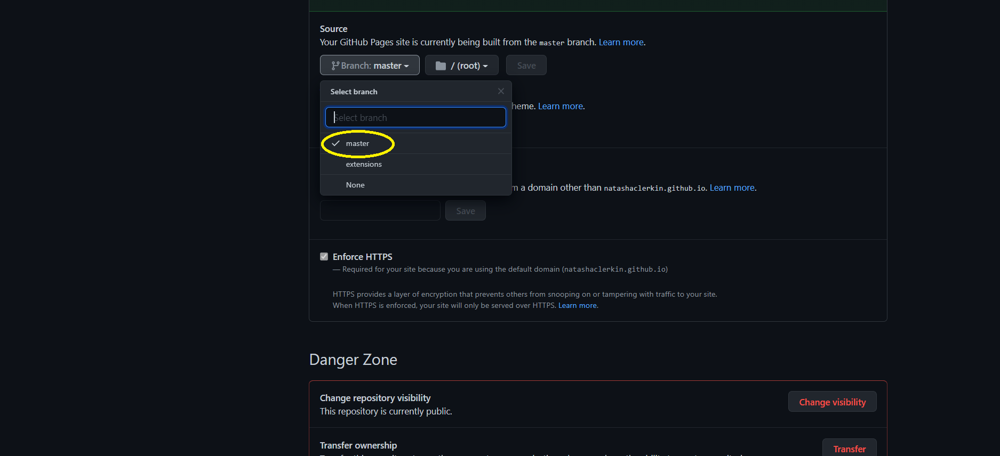

3. Once I saved the Master Branch as the source, the page refreshed and I located the URL to the deployed website.

4. I then followed the link to observe and verify the published GitHub page. 
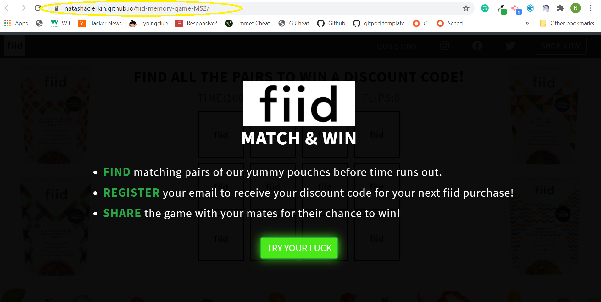

# Credits
 
### Media
 The images used in this site were obtained from the following sources:

- Fiid Company Logo - [from Fiid's Website](https://cdn.shopify.com/s/files/1/0072/0165/2802/files/fiid-main-logo_410x.png?v=1531837903)
- Fiid Header Image (with edits made in Photoshop)- [from Fiid's Website](https://cdn.shopify.com/s/files/1/0072/0165/2802/files/Website_Banner_NEW_1900x.progressive.jpg?v=1610033437)
- card images 
- yummy https://hypeddit.com/track/c0q1eo

### Acknowledgements

I took inspiration from the following sources however I did implement my own custom code with each snippet also:
https://www.w3docs.com/snippets/css/how-to-create-flashing-glowing-button-using-animation-in-css3.html
     

Fiid

Finally, I would like to thank my mentor Guido Cecilio for his overall support throughout the project.