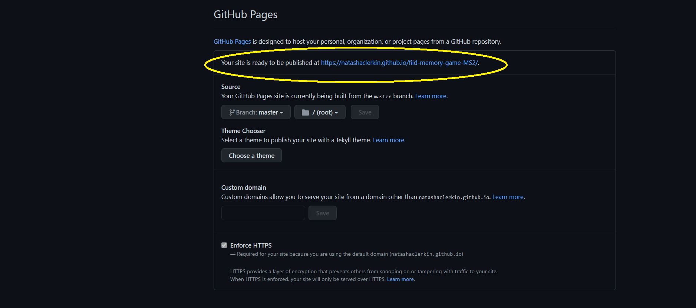

# Fiid Match & Win Memory Game

## Code Institute MS2 Project in Interactive Frontend Development 
The brief was to develop an interactive front-end site which responds to the users' actions, allowing them to actively engage with data, alter the way the site displays the information to achieve their preferred goals. This website is created for educational purposes.

  

[View website in GitHub Pages.](https://natashaclerkin.github.io/fiid-memory-game-MS2/) 

---
# Contents

- [Project Overview](#project-overview)
- [UX](#ux)
- [Features](#features)
- [Testing](#testing)
- [Technologies Used](#technologies-used)
- [Deployment](#deployment)
- [Credits](#credits)

# Project Overview
[^ Back To Top ](#contents) 
## [Fiid Match & Win Memory Game](https://natashaclerkin.github.io/fiid-memory-game-MS2/) 

Irish plant-based food B2C company, Fiid, create crave-worthy, convenient vegan meals. They are looking to further brand awareness, increase customer acquisition and maintain brand loyalty. They would like to drive sales by creating a timed memory game for users to win a discount code for their next online purchase. The user has to match two of each product type before the time runs out. If they are successful, they are able to subscribe to earn a discount code which will be valid for their next purchase. Users have the ability to share the game with their followers on social media. The target audience are health-conscious individuals, particularly the 18-35 millennial bracket who like games and discounts. 

The primary goal of the main Fiid website is to inform and direct users to place an order. I wanted to create an experience that integrates with their main website. This would include instructions on how the game works, how to obtain the discount code through a short signup form and how they can spread the word through social media. There would also be links to the company's social media channels and most importantly the main online store. This would allow users to learn more about the products, place an order or share the game with their followers on their own channels.

The opportunity to win a discount code incentivizes participation aswell as increasing brand recognition and follower engagement. In order to obtain the discount code, the user has to register through an entry form for lead generation and simultaneously allows the user to sign up to the newsletter. The concept is to offer a discount to all registered users in order to convert them into paying customers.

**The business goals of this website are:**

- Market the current offering of Fiid products.
- Increase customer acquisition.
- Increase brand recognition and follower engagement. 
- Make the brand stand out from the swarm of plant-based companies during Veganuary. 
- Target a younger audience who have more disposible income such as millennials.

**The customer goals of this website are:**

- Obtain a discount towards future orders.
- Learn about the product offering.
- Have a good experience while on the site.

# UX
[^ Back To Top ](#contents) 
### Strategy
It's vital as a B2C company to stand out amongst the competition because the B2C space is crowded with competitors. Most users will make their purchase on one of their first few visits so it is so important to grab the user and keep them on the site long enough to place the order. Compelling but minimal text accompanied by lots of imagery is required to keep the user engaged. 
As the memory game is a huge part of the customer acquisition process, it has to be developed to a high standard and respond correctly to the user's interactions. The overall game will be simple enough for the user to complete in order to reward them for their time and encourage them to place an order.  

#### Ideal users of this website:
- Vegan/health-conscious individuals
- Working adults who are looking for convenient meal products for themselves or their families 
- Millennials

#### These users are looking for:
- Discounts
- Quality, healthy and convenient products
- Hassle-free ordering

#### This project is the best way to achieve their goals because:
The market is saturated with plant-based products and the user wants a quality product at a discounted price. The short game makes the company stand out from the crowd and rewards the user if they can remember the brand's offering.

#### User Stories
 
1. **_As a new visitor to the website,_** I want to find out about the products on offer and why I should purchase from the company as opposed to similar brands so that I can potentially become a customer. 

2. **_As a regular customer of the brand,_** I want to be rewarded for my loyalty so that I can receive discounts/offers on future orders and remain a loyal customer.  

3. **_As a user on the site,_** I want to have an enjoyable and hassle-free experience so that I can potentially place an order.

### Scope
To achieve the strategic goals, I wanted to include the following features in this production release:

- Instructions for the game with inviting 'try your luck' **button**
- Simplistic, interactive **JavaScript-led timed memory game** using  - including timer and flip counter
- Header containing company logo and **Nav bar** with minimal content to not distract player- i.e. just necessary links such as social media and link to main Fiid site
- **Background image** featuring company products
- Short **signup form** for users to complete in order to receive a discount

### Structure 
The user will be presented with a short, simple user-friendly game leaving them with an enjoyable experience, a lasting memory of the 4 Fiid products and hopefully a discount to use at the checkout. 
 
### Skeleton
- [Wireframes](assets/wireframes/wireframes.pdf "Fiid Wireframes"): The project contains the instructions screen, the game screen, gameover screen and win screen.
**Please note the finalised project contains slight variations to the original wireframe**

### Surface 
As a B2C company, sales are emotionally driven and often as an impulse buy. Branding is a huge factor and emotional triggers lead a customer to purchase a product. It was important to build the memory game on a page that reflected the brand and their product offering. The monochrome colour scheme was implemented along with pops of green to reflect the healthy and fresh products.
The banner assets of fresh produce and company typography was also implemented to integrate the game page as part of the brand and propel the user towards the shop after completion.

# Features
[^ Back To Top ](#contents) 

The fully responsive site consists of:

**_Game Page:_**
- **Main page content:** Once the 'Try your luck' button is selected, the page loads to reveal the navbar, background image with company products, gameboard with cards, timer, flip counter and background music. The game starts automatically.
- **Timer:** The time counts down from 30 seconds and displays the time remaining for the user to complete the game.
- **Flip counter:** This counts the number of flips the user has made, allowing them to monitor their progress.
- **Gameboard:** This displays 12 game cards face down ready to be clicked.
- **Game cards:** Each card has the Fiid logo on the back and contains 1 of 6 Fiid product images to be matched by the user to win the game. The cards have a flip sound effect when selected and turned. When a match is found, a correct match sound effect can be heard. The matched cards remain faceup for product placement.
 
**_Audio:_**
- **Background music:** The "Yummy" by Justin Bieber instrumental audio starts when the 'Try your luck' button is selected and ends when the game is won or lost.
- **Card flip sound effect:** The sound is executed when a user selects a card. The audio is remeniscent of a playing card being flipped.
- **Victory sound effect:** The audio is played once all cards have been matched correctly before the timer runs out.
- **Game Over sound effect:** This audio is triggered when the timer hits zero before all cards have been matched correctly.

**_Overlays:_**
- **Instructions overlay:** I used an overlay instead of a separate page so the user can slightly see the game behind it and to give the user an indication like there are less steps to receive their discount. This includes three straightforward instructions with the main action highlighted for better UX and is accompanied by the enticing 'Try your luck' button.
- **Victory overlay:** Along with the audio, the overlay and modal is executed when the user wins the game. They are presented with the modal which requests their email to receive their discount code. They are also offered the option to subscribe to the newsletter. Once they have completed the form, a message appears that they have been sent their discount code via email. The user is invited to shop on the main website or challenge their friends to he game via social media or email. 
- **Game Over overlay:** Accompanied by the Game Over audio, the overlay is triggered when the user loses the game. They are presented with the button to 'Try again'. 

### Features Left to Implement
Due to time restraints, I was unable to include the following features but hope to implement them in future releases:
- **Score Board:** To allow users to see where they ranked in terms of other players and the ability to share this score with their friends online.
- **Levels:** If extra levels are to be added (i.e additional cards or difficulty options) then free products can be offered to the user as a reward for the added time spent on the game.
- **Mute Button:** If further levels are implemented, then a mute button would be required as the user is spending more of their free time on the game. This means UX is even more significant and any possible deterrants such as audio need to be offered as option to the user to avoid them exiting the game. 

# Technologies Used
[^ Back To Top ](#contents) 

In the construction of this project I have utilised the following languages, frameworks, libraries and tools:
- **HTML5,** **CSS3** and **JavaScript** programming languages
- [Bootstrap v4.5.3](https://getbootstrap.com)
    - The project used **Bootstrap** to simplify the website layout by integrating the Congrats Modal and Navbar. Also to provide overall responsive behaviour on all devices.
- [GitPod](https://www.gitpod.io/)
    - I used **GitPod** as the development environment for my website. I also used Git for Version Control in the project.
- [GitHub](https://www.github.com/)
    - The project used **GitHub** to host my code that was created and pushed from GitPod.
- [Balsamiq](https://balsamiq.com/)
    - I used **Balsamiq**, the rapid low-fidelity UI wireframing tool during the prototyping phase to structure the website and its content following best UX practices.
- [Color Hex](https://www.color-hex.com/)
    - I created the color palette for my project using the theme colours of the main Fiid website and **Color Hex** to help structure the UI for the game. 
- [Photoshop](https://www.photoshop.com)
    - I created the background image using the image graphics editor **Photoshop** so each Fiid product is visually on screen for the duration of the game to further brand/product awareness.
- [Chrome Dev Tools](https://developers.google.com/web/tools/chrome-devtools)
    - **Chrome Dev Tools** was used to consistently test the site and run reports from Lighthouse.
- [Google Fonts](https://getbootstrap.com)
    - **Google Fonts** was used to style the website fonts.
- [Font Awesome](https://fontawesome.com/)
    - I used the font & icon toolkit Font Awesome in the win modal to define elements by a visual means and break up the larger section of text.
- [Favicon.io](https://favicon.io/)
    - **Favicon.io** was used to generate the favicons for the site.    
- [Freeformatter CSS Beautify](https://www.freeformatter.com/css-beautifier.html)
    - I used **CSS Beautify** to format and automatically indent my CSS file.
- [Freeformatter HTML Formatter](https://www.freeformatter.com/html-formatter.html)
    - The **HTML Formatter** was used to format the HTML document.  
- [Freeformatter JS Formatter](https://www.freeformatter.com/javascript-beautifier.html)
    - The **JavaScript Formatter** was used to format the JS file.      
- [Unicorn Revealer](https://chrome.google.com/webstore/detail/unicorn-revealer/lmlkphhdlngaicolpmaakfmhplagoaln)
    - I regularly used the **Unicorn Revealer** Chrome extension to inspect and locate where overflow was located making the debugging process a lot easier. 
- [Autoprefixer](https://autoprefixer.github.io)
    - The project used PostCSS plugin **Autoprefixer** which parsed my CSS and added vendor prefixes to allow cross-browser compatibility and support.
- [Color Contrast Accessibility Validator](https://color.a11y.com/)
    - The **Color Contrast Accessibility Validator** was used to test for colour contrast on the project.
- [W3C Markup Validation Service](https://validator.w3.org/)
    - The **W3C Markup Validation Service** checked the markup validity of Web documents in HTML.
- [W3C CSS Validation Service](https://jigsaw.w3.org/css-validator/)
    - **W3C CSS Validation Service** was used to check the validity of my CSS in the project.
- [JS Hint Validator](https://jshint.com/)
    - **JS Hint** was used to analyze and ensure the source code complies with coding rules. 
- [WAVE Web Accessibility Evaluation Tool](https://wave.webaim.org/)
    - I used **WAVE** to make my site more accessible to individuals with disabilities by detecting any potential issues.

# Testing
[^ Back To Top ](#contents)

The Testing process has been documented in this [testing.md file](/testing.md "testing.md File")

# Deployment

[^ Back To Top ](#contents) 

This site is hosted using GitHub pages, deployed directly from the master branch. The deployed site will update automatically upon new commits to the master branch. For the site to deploy correctly on GitHub pages, the landing page must be named index.html.

To run locally, you can clone this repository directly into the editor of your choice by pasting git clone https://natashaclerkin.github.io/fiid-memory-game-MS2 into your terminal. To cut ties with this GitHub repository, type git remote rm origin into the terminal.

My project was developed using the IDE, Gitpod. I deployed my website from the GitHub repository to GitHub Pages using the following steps:

1. I selected the Settings tab in my GitHub repository.

2. I located the GitHub Pages section and chose the Master branch as the source to enable GitHub Pages.

3. Once I saved the Master Branch as the source, the page refreshed and I located the URL to the deployed website.

4. I then followed the link to observe and verify the published GitHub page. 

# Credits
[^ Back To Top ](#contents) 
### Media
 The images used in this site were obtained from the following sources:

- Fiid Company Logo - [from Fiid's Website](https://cdn.shopify.com/s/files/1/0072/0165/2802/files/fiid-main-logo_410x.png?v=1531837903)
- Fiid Header Image (with edits made in Photoshop) - [from Fiid's Website](https://cdn.shopify.com/s/files/1/0072/0165/2802/files/Website_Banner_NEW_1900x.progressive.jpg?v=1610033437)
- Card product pouch images - [from Fiid's Website](https://www.eatfiid.com)
- 'Yummy' by Justin Bieber instrumental background music - [from Hypeddit](https://hypeddit.com/track/c0q1eo)
- Card flip sound effect - [from Freesound.org](https://freesound.org/people/f4ngy/sounds/240776/)
- Correct card match sound effect - [from Freesound.org](https://freesound.org/people/ertfelda/sounds/243701/)
- Victory sound effect - [from Freesound.org](https://freesound.org/people/unadamlar/sounds/341985/)
- Gameover sound effect - [from Freesound.org](https://mixkit.co/free-sound-effects/game-over/)
 

### Acknowledgements

I took inspiration from the following sources however I did implement my own custom code with each snippet also:

- I undertook alot of research into JavaScript game development through reading material and watching tutorials from [Portexe](https://portexe.com/), [Code Resources](https://www.ci-resources.online/), [Scotch.io](https://scotch.io/tutorials/how-to-build-a-memory-matching-game-in-javascript), [Dribbble](https://dribbble.com/tags/memory_game), [Wes Bos](https://courses.wesbos.com), [Watch and Code](https://watchandcode.com/courses), [Dev.to](https://dev.to/fakorededamilola/create-a-memory-game-with-js-1l9j).
- I practiced JS and the research material on [W3 Schools](https://www.w3schools.com/) and [CodePen](https://codepen.io/).  
- Bootstrap was used for the [Navbar](https://getbootstrap.com/docs/4.4/components/navbar/) and the [Loading Spinner](https://getbootstrap.com/docs/4.4/components/spinners/).
- I implemented the [Fisher–Yates Shuffle](https://bost.ocks.org/mike/shuffle/) in my game to randomize the card shuffle.
- I came across this [Glowing Button Animation](https://www.w3docs.com/snippets/css/how-to-create-flashing-glowing-button-using-animation-in-css3.html) when I was searching for inspiration for enticing 'Try your luck' & 'Try Again' buttons.
- During development I found solutions to smaller coding queries in Stack Overflow as well as when I had difficulties with the [Modal Positioning](https://stackoverflow.com/questions/33184157/bootstrap-modal-height-as-per-window-height) and [Preventing the win modal from disappearing when clicking outside](https://stackoverflow.com/questions/16152073/prevent-bootstrap-modal-from-disappearing-when-clicking-outside-or-pressing-esca)

I would like to thank my mentor Guido Cecilio for his support in helping me to understand JavaScript and guidance throughout the project. 

Last but certainly not least, I'd like to thank the amazing Fiid for their use of content, imagery and real-life business concept for the project. I am a happy customer and was only too excited to use them and their yummy pouches as the source material for my project!