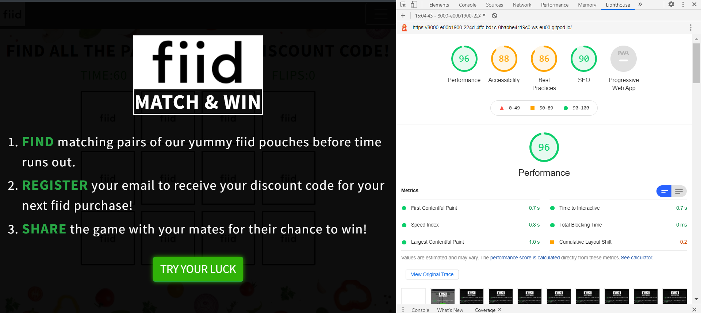
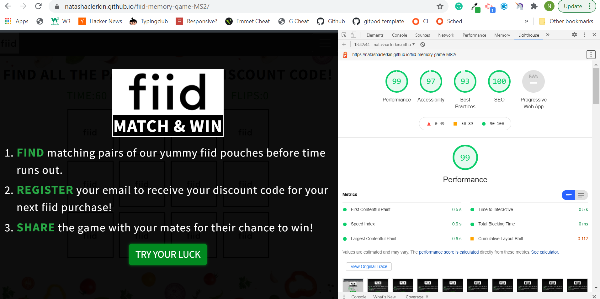

# Project Testing

1. [Automated Testing](#Automated)

2. [Manual Testing](#Manual)

3. [User Stories](#User)

4. [Bugs](#Bugs)

## Automated Testing
[^ Back To Top ](#project-testing)
### Validation Programs

I used the [W3C Markup Validation Service](https://validator.w3.org/) to check the Markup and [W3C CSS Validation Service](https://jigsaw.w3.org/css-validator/) to check the CSS validity and [JS Hint Validator](https://jshint.com/) to check the JS rules of the project. After fixing the errors on all testing sites, the sites eventually passed validation.

The [Color Contrast Accessibility Validator](https://color.a11y.com/) was used to test for colour contrast on the project.

I found one of the original green shades used for the buttons wasn't working from an accessibility standpoint. I used the contrast testing feature to choose a hex color that would pass the validation tests.

When I decided on the final shade, I re-ran the tests confirming no further colour contasting issues to be found and the overall site complies with accessibility standards.

In order to have optimal user experience, the site needs to be accessible. I would continually run the URL through **WAVE Web Accessibility Evaluation Tool** to highlight potential issues. I continued until no further errors or alerts were given.

I constantly tested the code in [Chrome Dev Tools](https://developers.google.com/web/tools/chrome-devtools) and often ran Lighthouse audits to identify and fix issues that affected the site's performance, accessibility and user experience. 

This highlighted areas that require improvement for validation. For example, Accessibility issues pointed to areas such as inadequate color contrast ratio which I tested and fixed in **Color Contrast Accessibility Validator**.
Also, a Cross-Origin security issue pertaining to Best Practices was simply resolved via adding `rel= noreferrer` to external links. I also ensured all the necessary aria labels, alt tags etc were present to conform to best practices. 
Through constant testing, I was able to achieve almost 100% on all metrics for optimum Performance, Accessibility, SEO and Best Practices.  

## Manual Testing
[^ Back To Top ](#project-testing)

I asked my family, friends and fellow students to test their site on different devices to locate potential bugs. The website was tested over multiple devices (Samsung Galaxy A7, Xiaomi Mi 10, iPhone 5, 6, 7, 11: Safari and Chrome, iPad, Google Nexus) and many browsers (Chrome, Firefox, Safari and Edge) to guarantee responsive behaviour and compatibility.  

The following actions were taken by each tester and the results noted below:

| ACTION      | TEST RESULT      |
| ----------- | ----------- |
| **Open the Fiid Match & Win website**    | *"The Link opens to main landing page with game instructions."*       |
| **Read game instructions**   | *"Instructions are clear and concise."*       |
| **Select 'Try Your Luck' button to start the game**  | *"The button rediverts to the gameboard."*
| **Let the timer run out to reach Game Over screen and select 'Try Again' button**  | *"When the timer reaches zero and the cards haven't been all matched, the game ends with Game Over screen and audio with the option to play again"*        |        |
| **Match all pairs to complete the game in 30 seconds**  | *"The new screen is presented with flips reset to 0 and timer back to 30. All cards are matched on time and a new screen with a congratulations audio and message pops up."*        |
| **Responsive design?**  | *Text*        |
| **User friendly display?**  | *Text*        |
| **Interactive objects working correcly?**  | *Text*        |
| **Music & sound effects work on device?**  | *Text*        |
| **Links divert to expected destinations?**  | *Text*        |
| **Functional subscription form?**  | *Text*        |
| **Ability to share game on social media & via email?**  | *Text*        |

## User Stories
[^ Back To Top ](#project-testing)

1. **_As a new visitor to the website,_** I want to find out about the products on offer and why I should purchase from the company as opposed to similar brands so that I can potentially become a customer. 

2. **_As a regular customer of the brand,_** I want to be rewarded for my loyalty so that I can receive discounts/offers on future orders and remain a loyal customer.  

3. **_As a user on the site,_** I want to have an enjoyable and hassle-free experience so that I can potentially place an order.

## Bugs
[^ Back To Top ](#project-testing)

### Resolved Bugs
I encountered the following bug during the development of this project:

**Issue 1:**  *_User can click off the Win modal back onto the game after completion despite being the end of the user journey._*

**_Status:_**
The below solution was found on [Stack Overflow](https://stackoverflow.com/questions/16152073/prevent-bootstrap-modal-from-disappearing-when-clicking-outside-or-pressing-esca) and utilised to fix this bug:
`$('#elegantModalForm').modal({ backdrop: 'static', keyboard: false, show: false });` 

### Unresolved Bugs
**Issue 1:** *_Delay with audio from second card flip when cards are selected in quick succession on some mobile devices._*

**_Status:_** Currently investigating and will implement fix in next release.

**Issue 2:** *_User can complete form without having to input email address despite required attribute present._*

**_Status:_** Currently investigating and will implement fix in next release.