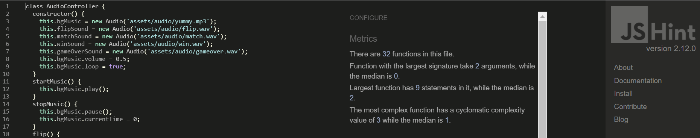

# Project Testing

1. [Automated Testing](#automated-testing)

2. [User Stories and Manual Testing](#user-stories-and-manual-testing)

3. [Bugs](#bugs)

## Automated Testing
[^ Back To Top ](#project-testing)
### Validation Programs

I used the [W3C Markup Validation Service](https://validator.w3.org/) to check the Markup and [W3C CSS Validation Service](https://jigsaw.w3.org/css-validator/) to check the CSS validity and [JS Hint Validator](https://jshint.com/) to check the JS rules of the project. After fixing the errors on all testing sites, the sites eventually passed validation.

The [Color Contrast Accessibility Validator](https://color.a11y.com/) was used to test for colour contrast on the project.

I found one of the original green shades used for the buttons wasn't working from an accessibility standpoint. I used the contrast testing feature to choose a hex color that would pass the validation tests.

When I decided on the final shade, I re-ran the tests confirming no further colour contrasting issues to be found and the overall site complies with accessibility standards.

In order to have optimal user experience, the site needs to be accessible. I would continually run the URL through **WAVE Web Accessibility Evaluation Tool** to highlight potential issues. I continued until no further errors or alerts were given.

I constantly tested the code in [Chrome Dev Tools](https://developers.google.com/web/tools/chrome-devtools) and often ran Lighthouse audits to identify and fix issues that affected the site's performance, accessibility and user experience. 

This highlighted areas that require improvement for validation. For example, Accessibility issues pointed to areas such as inadequate color contrast ratio which I tested and fixed in **Color Contrast Accessibility Validator**.
Also, a Cross-Origin security issue pertaining to Best Practices was simply resolved via adding `rel= noreferrer` to external links. I also ensured all the necessary aria labels, alt tags etc were present to conform to best practices. 
Through constant testing, I was able to achieve almost 100% on all metrics for optimum Performance, Accessibility, SEO and Best Practices.  

## User Stories and Manual Testing
[^ Back To Top ](#project-testing)

"As a general user, I would like to have an **enjoyable experience** playing an easy memory game that provides a **reward** for completing the game and lets me **learn more about the brand.**"

The game promises a simple, user-friendly experience. There is essentially only one page the user experiences as the instructions and results operate as an overlay to give the user the impression they are closer to their "reward". During the game, the user has to memorise the brand's offering by matching all available pairs of cards. The instrumental version of Justin Bieber catchy tune 'Yummy' is played to have a soothing effect on the user whilst reiterating the brand's product qualities. The sound effects simulate a real card-matching game but add an alert to confirm to the user when they have a pair of cards matched correctly. If the user cannot match the cards in time, they are encouraged to play again. Once all cards are matched, a simple form appears where they only have to input their email address to receive their discount. They also have the option of subscribing to the newsletter. The game does not just conclude on a victory but provides links to the main Fiid site so the user can find out further product and brand information. There is also an option for the user to share the game with their friends if they wish. 

I asked my family, friends and fellow students to test their site on different devices to locate potential bugs. The website was tested over multiple devices (Samsung Galaxy A7, Xiaomi Mi 10, iPhone 5, 6, 7, 11: Safari and Chrome, iPad, Google Nexus) and many browsers (Chrome, Firefox, Safari and Edge) to guarantee responsive behaviour and compatibility. The below actions were taken by each tester. 

| ACTION      |  EXPECTED OUTCOME    |
| ----------- |  -----------
| **Open the Fiid Match & Win website**  |     The link should open to the main landing page with game instructions.   |
| **Read game instructions**   |      Instructions should be clear and concise and the user should have the clarity to begin the game.|
| **Select 'Try Your Luck' button to start the game**  | The button should redivert to the gameboard.  | 
| **Check background music is audible, timer and flips are operating and cards are face-down once the game has commenced**  | When the 'Try Your Luck' button is clicked, the overlay should disappear and the main game page should load. The background music should begin playing, the timer should start counting down from 30 and all 12 cards should be face-down until selected.  
| **Let the timer run out to reach the Game Over screen and select 'Try Again' button**  |  When the timer reaches zero and the cards haven't been all matched, the game should end with the Game Over overlay screen and audio with the flashing 'Try Again' button inviting the user to play again. | 
| **Restart the game and match all pairs to complete the game in 30 seconds**  | The new screen should be presented with the flips total reset to 0 and the timer reset back to 30. When a card is selected, a flip sound effect should be heard and the card should rotate 180 degrees to become face-up and reveal a Fiid product. If the two selected cards are not a match, they should return to the face-down position after being visible long enough so the user can remember the cards just selected. Once a pair is matched, a correct sound alert should be audible and the pair should remain face-up. All matched pairs should be disabled and shouldn't have the ability to be flipped again. Repeated clicks on the matching pairs should not affect the flip counter. If all cards are matched within the timeframe, a new screen with a congratulations sound effect and message should pop up.| 
| **Input email to receive the discount and sign up for the newsletter**  | Once a correct email is entered and submitted, a loading icon will appear to indicate that an action has occurred. A message should then appear confirming that the discount code has been sent to the user's email address. Another message should be present to invite the user to explore the main Fiid website or share the link to the game on social media. 
| **Test share URLs and website link**  | The share buttons should bring the user directly to a new post with the link pre-typed to the selected social media channel. The email button should open the user's email provider if pre-installed with the subject line and body pre-filled. The 'Shop Fiid' link should divert the user to the Fiid online store.  

Several minor bugs or issues were reported during development and testing but the majority were easily fixed with assistance from **Chrome Dev Tools** and **Unicorn Revealer** to locate the source. Any significant bugs are listed in the section below.

## Bugs
[^ Back To Top ](#project-testing)

### Resolved Bugs
I encountered the following bug during the development of this project:

**Issue 1:**  *_User can click off the Win modal back onto the game after completion despite being the end of the user journey._*

**_Status:_**
The below solution was found on [Stack Overflow](https://stackoverflow.com/questions/16152073/prevent-bootstrap-modal-from-disappearing-when-clicking-outside-or-pressing-esca) and utilised to fix this bug:
`$('#elegantModalForm').modal({ backdrop: 'static', keyboard: false, show: false });` 

### Unresolved Bugs
**Issue 1:** *_Delay with audio from second card flip when cards are selected in quick succession on some mobile devices._*

**_Status:_** Currently investigating and will implement a fix in the next release.

**Issue 2:** *_User can complete form without having to input email address despite required attribute present._*

**_Status:_** Currently investigating and will implement a fix in the next release.

[^ Back To Top ](#project-testing)